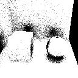

# luacg


## Description


luacg is a project implements computer graphics algorithms in pure lua.

you can learn computer graphics by reading the source code and making changes.

more algorithms will be added in the future.

## Usage

To use luacg, you need a lua interpreter, official interpreter does not containing opengl features.

Please download the interpreter built from [luagl](https://github.com/waizui/luagl) project. It can be downloaded [here](https://github.com/waizui/luagl/releases).

To execute luacg, cd to the root folder of this project and execute following command in your command-line interface. 

```bash
path_to_lua_interpreter ./scene.lua
```
The "path_to_lua_interpreter" should be path to the interpreter you have downloaded.

For example, if you have downloaded lua interpreter in the root folder of this project, use:

```bash
./lua.exe ./scene.lua
```

The execution results will be placed in the root folder of this project.

## List

### 1. rasterisation and  barycentric coordinates


### 2. naive ray casting


### 3. quaternion and rotation


### 4. BVH accelerated ray casting


### 5. Monte Carlo ambient occlusion



### 6. OpenGL example


## References

[Appied Computer Graphics by Prof. Nobuyuki Umetani](https://github.com/ACG-2024S/acg)

[pbr-book](https://pbr-book.org/4ed/contents)

[lua-pngencoder](https://github.com/wyozi/lua-pngencoder)
